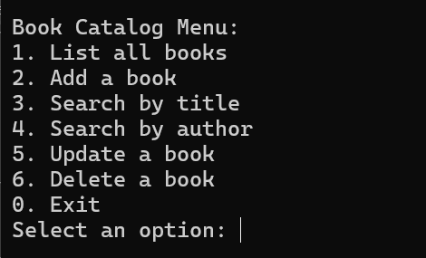
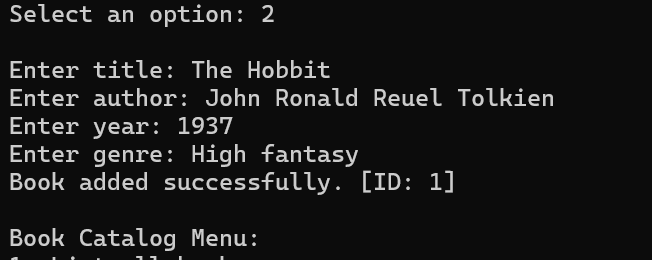
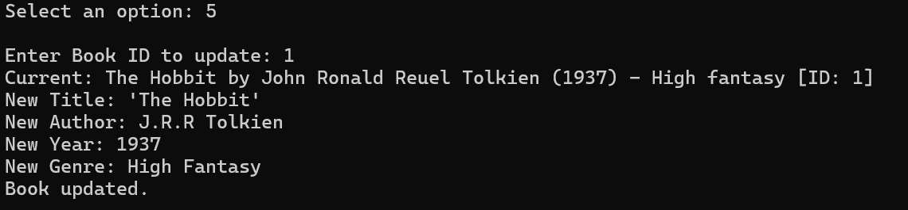
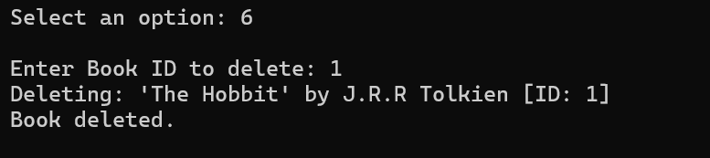
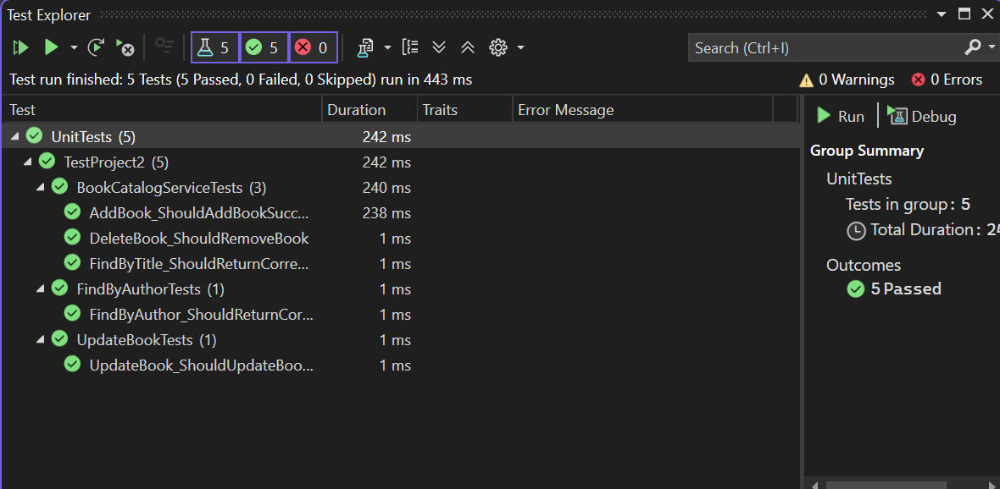
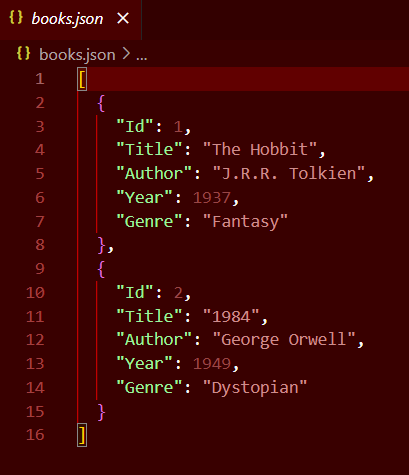

# Book Catalog System

The Book Catalog system was designed to follow Clean Architecture principles, which emphasize separation of concerns and modular design. The application is organized into three main layers: Domain, Application (Use Cases), and Infrastructure.

## Team 2 Members:
- Mariam Rusishvili - Developer 1 . Created the main structure of the code and base layer for the program.cs. Also created the main project file in Visual Studio 2022
- Nini Jakhaia - Unit tests . Created the ReadMe.md. tested the final project's every function. Created unit tests and built and ran them on the code. Contributed to the cleanness of the code
- Tamar Tateshvili - Project manager. divided the project tasks accordingly to the group, managed the work throughout the week. organised meetings and contributed to the infrastructure layer, and oversaw the overall cleanliness of the code.
- Tamar Kvirikashvili - Developer 2  . added functionality to the main project.cs. Finished up the main program and fixed runtime errors. managed program memory in both local and json files.

## Clean Architecture Highlights

### 1. Domain Layer
Defines the core entity: Book, which contains properties like Id, Title, Author, Year, and Genre.  
Also includes the `IBookRepository` interface, which declares the operations supported by any book storage mechanism (e.g., add, retrieve, search, update, delete).

### 2. Application Layer (Use Cases)
Implements the `BookCatalogService` class, which contains the business logic for managing books.  
This service provides the following functionality:

- `AddBook(Book)` — adds a book while ensuring a unique ID is assigned.  
- `GetAllBooks()` — retrieves all books from the repository.  
- `FindByTitle(string)` and `FindByAuthor(string)` — searches books using case-insensitive and partial matching.  
- `UpdateBook(Book)` — updates an existing book's details.  
- `DeleteBook(Guid)` — removes a book by ID with validation.

### 3. Infrastructure Layer
Contains `InMemoryBookRepository`, an in-memory implementation of `IBookRepository`.  
Stores books using a `List<Book>` and handles all data access operations, including filtering and updating.

### 4. Dependency Injection
The `BookCatalogService` receives its repository dependency via constructor injection.  
In the `Main` method, the repository is instantiated and passed to the service:

IBookRepository repository = new InMemoryBookRepository();  
var service = new BookCatalogService(repository);

Functional Capabilities:

1. Add Book: Add a book by providing title, author, year, and genre.

2. List All Books: View all books currently in the catalog.

3. Search by Title: Find books with titles that match a partial or full search term (case-insensitive).

4.Search by Author: Same as above, but for author names.

5.Update Book: Change an existing book’s title, author, year, or genre.

6.Delete Book: Remove a book from the catalog by its unique ID.

## Unit Testing

This project includes automated unit tests using MSTest to verify that key operations work as expected:
Each test checks a specific feature of the catalog to make sure it behaves correctly.

## BookCatalogServiceTests.cs

Tests adding a book, searching by title, and deleting a book.
Ensures:
A book is successfully added to the list.
The correct book is found when searching by a keyword in the title.
A book is removed from the list after deletion.

## FindByAuthorTests.cs

Focuses on searching by author name.
Confirms:
Case-insensitive searches return all books written by authors whose names match the keyword.
Works even if the author name has different cases (e.g., "Jane", "JANE").

## UpdateBookTests.cs

Verifies that book details can be updated.
Ensures:
Title, author, and year of the book are updated correctly.
The update reflects immediately in the book list.

The memory also has capabilities to store the added books in the json file which is created during program execution. However this additional feature is still in development and thus commented in the Program.cs

